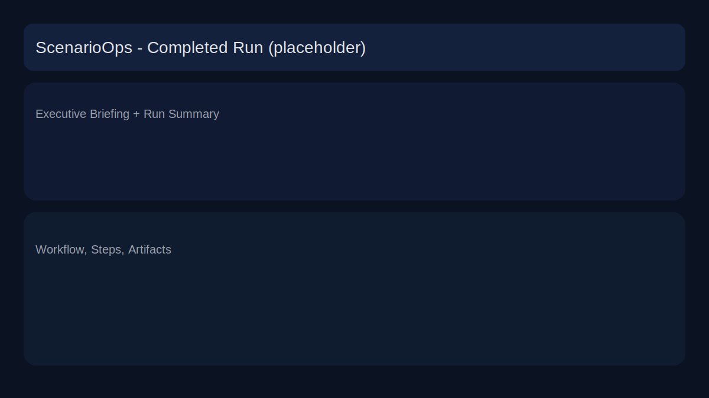
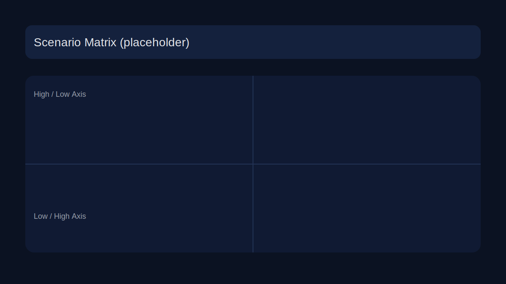
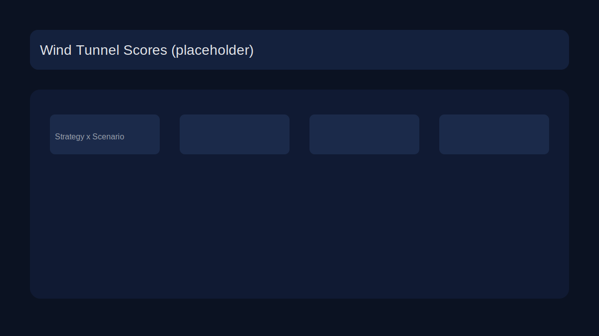

# Deploying ScenarioForge on Cloud Run

## Discovery

### Backend entrypoint + run endpoints
- **Server framework:** FastAPI (`src/scenarioops/app/api.py`).
- **ASGI app path:** `scenarioops.app.api:app` (used by `Dockerfile` and `README.md`).
- **Relevant endpoints (current):**
  - `POST /build` → launches a run (writes to local `storage/runs/<tenant>/<run_id>`).
  - `GET /runs` → list run ids + labels.
  - `GET /runs/{run_id}` → serves the UI shell (commercial dashboard).
  - `GET /artifact/{run_id}/{artifact_name}` → fetch run artifacts (JSON/text).
  - `GET /artifact/{run_id}/image/{image_name}` → fetch run images.
  - `GET /run/{run_id}/node_events` / `/normalization` / `/logs/{name}` → run logs.
  - `GET /latest` → latest run pointer (uses local `latest.json` or DB).
  - `POST /chat` → run-scoped chat (uses vector DB).
  - `POST /action-console/...` → action console artifacts.
  - `POST /upload` → upload inputs (optional; requires `python-multipart`).

### Run artifact write paths (current)
- **Primary storage:** local filesystem under repo root:
  - `storage/runs/<tenant_id>/<run_id>/`
  - `run_config.json`, `run_meta.json` (if present), `latest.json` (pointer)
  - `artifacts/` (JSON + images), `logs/node_events.jsonl`, `logs/normalization.jsonl`
  - `inputs/`, `derived/`, `trace/`, `reports/`, `vectordb/`
- **Storage code:** `src/scenarioops/graph/tools/storage.py`
  - `default_runs_dir()` → `storage/runs`
  - `write_artifact`, `write_run_config`, `log_node_event`, `write_latest_status`
- **S3 + Postgres support:** Optional mirroring in `storage.py` (S3/DB), **not** GCS.

### Gemini API key usage (current)
- **LLM key source:** `src/scenarioops/llm/client.py`
  - `get_gemini_api_key()` reads `GEMINI_API_KEY` from environment or `.env`.
  - No request-level override (headers/query) used for LLM client init.
- **FastAPI auth key:** `src/scenarioops/app/api.py::_tenant_context`
  - Accepts `X-Api-Key` or `Authorization: Bearer <key>` to resolve tenant.
  - No query param support for keys.
- **UI key flow:** `commercial_ui.html` stores `scenarioops_api_key` in localStorage
  and sends as `X-Api-Key` for **all** API calls (including read-only).

### Vector DB usage (current)
- **Library:** local SQLite store (`src/scenarioops/graph/tools/vectordb.py`).
- **Persistence path:** local disk:
  - per-run: `storage/runs/<run_id>/vectordb/embeddings.sqlite`
  - or global: `storage/vectordb/embeddings.sqlite`
- **Failure behavior:** Some calls are guarded (e.g., `/chat` catches exceptions), but
  pipeline still assumes local FS availability. No GCS persistence.

### Retry logic + status derivation (current)
- **Node events:** appended to `logs/node_events.jsonl` via `log_node_event`.
  - `record_node_event` logs `OK` or `FAIL` once per call (no attempts count).
- **Run status:**
  - `latest.json` contains last write status.
  - View model derives status by scanning latest event per node (`build_view_model`).
  - No explicit retry attempts / status history persisted (last attempt not guaranteed in UI).

### What breaks on Cloud Run (and why)
- **Local filesystem storage** is ephemeral; `storage/runs/**` disappears on restart.
  Public run links will 404 or lose artifacts; dedup cannot work reliably.
- **GCS is not used**; S3/DB options are irrelevant on Cloud Run.
- **API key resolution is not deterministic per request**:
  LLM key is pulled only from env; no header/query override.
- **Read-only access** is not enforced; UI always expects a key (sends header).
- **Retry status** is not tracked as last attempt in a durable run metadata object.
- **Vector DB** is local-only and not safe across instances; failures can impact chat.

### Minimal change plan (modules to touch)
- Add `RunStore` abstraction and GCS implementation (new module under `src/scenarioops/storage/`).
- Route all run read/write operations through `RunStore` (storage, view model, API).
- Add deterministic API key resolver (new `src/scenarioops/security/api_keys.py`) and
  apply to Gemini client creation + API auth flow.
- Persist `run.json` (status + node map + signature + delete flags) and `events.jsonl`
  to GCS; update UI to read from run metadata for read-only mode.
- Implement dedup + soft delete using signature in persisted run metadata.
- Add `/health` endpoint + verification script + Cloud Run docs.

## Cloud Run Deployment

### Required env vars (Cloud Run)
- `RUN_STORE=gcs`
- `RUNS_DIR=/tmp/scenarioops/runs`
- `GCS_BUCKET=<your-bucket>`
- `RUNS_PREFIX=scenarioforge/runs`
- `GEMINI_API_KEY` via Secret Manager (required to launch live runs)
- `VECTOR_STORE=off` (recommended initially)
- Optional versioning:
  - `SCENARIOOPS_VERSION=<git-sha or build tag>`
  - `SCENARIOOPS_PIPELINE_VERSION=v1`

### Bucket setup + IAM
1. Create bucket:
   - `gsutil mb -l <region> gs://<your-bucket>`
2. Grant Cloud Run service account permissions:
   - Storage Object Admin (or minimum: Storage Object Creator + Storage Object Viewer).

### Deploy (gcloud)
```
gcloud run deploy scenarioforge \
  --source . \
  --region <region> \
  --allow-unauthenticated \
  --set-env-vars RUN_STORE=gcs,RUNS_DIR=/tmp/scenarioops/runs,RUNS_PREFIX=scenarioforge/runs,VECTOR_STORE=off \
  --set-secrets GEMINI_API_KEY=projects/<project>/secrets/<secret>:latest \
  --set-env-vars GCS_BUCKET=<your-bucket>
```

### Judge mode
- Provide a completed run URL: `https://<service>/runs/<run_id>`
- No API key required to view completed runs (read-only).
- Launching new runs requires a key (header or env secret).

## Verification

### Script
```
python scripts/verify_cloudrun_storage.py --base-url https://<service>
```

### Manual checklist
- `/health` returns `storage_backend: gcs` and `api_key_source` without exposing secrets.
- A completed run URL loads UI with artifacts visible (no Access prompt needed).
- Launch same params twice → reuse existing run (unless force rerun).
- Delete run → disappears from `/runs` list.
- Node retry → last attempt status shown in UI.

## Screenshots (placeholders)



